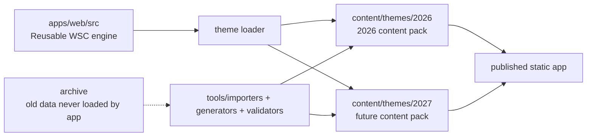

# WSC App Target Architecture

This document defines the target organization for the WSC app after cleanup.
The goal is to keep the current 2026 app behavior identical while making the
same engine reusable for 2027 and later themes.

## Core Idea

The app should be split into two worlds:

1. The reusable app engine.
2. The yearly content pack.

The engine knows how to render routes, cards, raw content, guides, quizzes,
games, auth, progress, PWA behavior, and analytics. It should not know the
specific 2026 theme content directly.

The yearly content pack contains the 2026 or 2027 material: guiding sections,
questions, guides, images, alpacards, videos, and asset references.

## Current Cleanup Milestone

The current app still boots from `app/index.html` and `app/app.js`, but the
main migration bridge now exists in `app/src/`:

- `app/src/ui/` owns extracted UI renderers for the wizard and Alpaccount modal.
- `app/src/modes/learn/` owns extracted Raw Content, Mind Map, Regular Guide, Alpacards, and Alpaca Channel renderers.
- `app/src/modes/play/alpacapardy/` owns the Alpacapardy engine, renderer, and first live event reducer.
- `app/src/services/` owns assets, storage, progress, auth, profile, raw-content filtering, game-question pools, and the future Alpacapardy Supabase bridge.
- `app/supabase/alpacapardy_live.sql` is the first live multiplayer schema target and is intentionally scoped to Alpacapardy only.



## Target Folder Structure

```text
WSC/                                      # repository root: everything related to the WSC app project
  apps/                                  # runnable applications that use the shared WSC content
    web/                                 # the browser/PWA/Vercel app
      index.html                         # HTML entry point loaded by the browser
      package.json                       # web-app dependencies, scripts, and build commands
      public/                            # static files copied directly to the published app
        app-icons/                       # install/PWA icons that are not tied to one yearly theme
        assets/                          # engine-level assets that can be reused by 2026, 2027, etc.
          shared/                        # engine-level generic shared images
          ui/                            # engine-level UI icons, not yearly content
          mascots/                       # reusable mascot base images used across themes
          modes/                         # reusable mode icons and game UI assets
      src/                               # reusable app engine source code
        main.js                          # boot file: starts the app and loads the selected theme
        app/                             # app shell and navigation logic
          app-state.js                   # central state: current theme, selection, user, progress
          app-router.js                  # routes between home, builder, modes, auth, and deep links
          app-shell.js                   # top-level render shell around all modes
          app-startup.js                 # startup/loading sequence and app-ready events
        config/                          # runtime switches and global configuration
          runtime-config.js              # environment URLs, active theme, deploy settings
          feature-flags.js               # temporary switches for migration and experiments
        services/                        # integrations and non-visual business logic
          analytics-service.js           # Vercel analytics/event tracking wrapper
          asset-service.js               # resolves asset IDs to real file paths
          auth-service.js                # login/logout/profile orchestration
          progress-service.js            # scores, completed routes, local/user progress
          storage-service.js             # localStorage/sessionStorage helpers
          pwa-service.js                 # service-worker registration and cache reset logic
          supabase-service.js            # Supabase client and database calls
        theme/                           # code that loads and validates yearly content packs
          theme-loader.js                # loads content/themes/{year}/manifest.json and linked files
          theme-schema.js                # expected shape of theme, sections, questions, assets
          theme-registry.js              # available themes: 2026 now, 2027 later
          theme-aliases.js               # resolves old IDs to canonical IDs during migration
        ui/                              # reusable UI code, not content data
          cards/                         # card components used by sections, modes, and results
          header/                        # header, hero, quick links, session controls
          modals/                        # auth modal, resources modal, image/video modals
          navigation/                    # wizard rail, step navigation, back/close controls
          shared/                        # buttons, labels, empty states, common DOM helpers
        modes/                           # reusable mode code; no yearly content should live here
          learn/                         # learning mode implementations
            raw-content/                 # code that displays raw content entries from a theme
            regular-guide/               # code that displays guide HTML/PDF/DOCX refs from a theme
            mindmap/                     # code that displays mindmap routes from a theme
            slideshow/                   # code that displays slideshow lessons from a theme
            alpacards/                   # code that renders alpacards; data stays in content/themes
            alpaca-channel/              # code that renders videos; video data stays in content/themes
            quiz/                        # code that runs quiz mode from theme questions
          play/                          # gameplay mode implementations
            alpaca-run/                  # code for Alpaca Run gameplay
            alpacapardy/                 # code for Alpacapardy gameplay
            alpaca-relay/                # code for local multiplayer relay gameplay
            build-case/                  # code for argument/build-case gameplay
            race/                        # code for Survivalpaca gameplay
        compatibility/                   # temporary bridge while current globals are migrated
          current-globals-adapter.js     # creates current window.WSC_* objects from new theme files

  content/                               # source content packs, separated from app engine code
    themes/                              # one folder per WSC year/theme
      2026/                              # 2026 content pack: Are We There Yet?
        theme.json                       # theme identity: year, title, subtitle, active flag
        manifest.json                    # table of contents: sections and optional theme-wide content
        aliases.json                     # maps old/short IDs to canonical section IDs
        assets.json                      # global 2026 asset registry by stable asset ID
        questions/                       # normalized question source shared by quiz and play modes
          question-bank.json             # source of truth for prompts, correct answers, distractors, feedback, levels, and placements
          question-bank.csv              # generated human-review table with one row per question
          README.md                      # explains how the bank is used during migration
        sections/                        # all 2026 guiding sections; most content lives inside sections
          introductory-questions/        # one section folder with same internal structure as all others
          progress-not-regress/          # one section folder
          more-to-do-than-can-ever-be-listed/ # one section folder
          the-end-is-nearish/            # one section folder
          theres-a-draft-in-here/        # one section folder
          were-all-in-this-to-get-there/ # one section folder
          where-the-sidewalk-starts/     # one section folder
          monkey-see-monkey-prototype/   # one section folder
          the-lovely-and-the-liminal/    # one section folder
          going-pains/                   # one section folder
          home-and-wandering/            # one section folder
          where-were-going-well-still-need-them/ # one section folder
          call-of-duty-free/             # one section folder
          next-year-in-futurism/         # one section folder
          concluding-questions/          # one section folder
        theme-wide/                      # only content that is genuinely not owned by one section
          alpacards.json                 # optional cross-section/general alpacards only
          channel-videos.json            # optional cross-section/general videos only
          assets/                        # optional cross-section/general content images
        theme-assets/                    # 2026 assets shared across multiple sections or modes
          app/                           # 2026-specific app branding if it changes by year
          ui/                            # 2026-specific UI-looking images, such as Discord/logo art
          mascots/                       # 2026-specific mascot variants
          modes/                         # 2026-specific mode artwork and decorative images
      2027/                              # future 2027 content pack using the same schema
        theme.json                       # 2027 theme identity
        manifest.json                    # 2027 table of contents
        aliases.json                     # 2027 aliases if needed
        assets.json                      # 2027 global asset registry
        sections/                        # 2027 guiding sections

  tools/                                 # scripts used to create, validate, or transform content
    importers/                           # scripts that import source docs/spreadsheets/videos
      docx/                              # DOCX importers for guides and raw content
      xlsx/                              # XLSX/CSV importers for question banks
      youtube/                           # video/channel metadata importers
    generators/                          # scripts that generate runtime bundles or derived files
      build-theme-bundle.js              # builds browser-ready theme data from content/themes
      build-regular-guides.js            # turns guide sources into guide HTML/PDF/DOCX outputs
      build-assets-manifest.js           # scans assets and writes assets.json/media.json
    validators/                          # scripts that fail when content references are broken
      validate-theme.js                  # validates theme.json and manifest.json
      validate-assets.js                 # validates asset IDs and physical file paths
      validate-questions.js              # validates question IDs, levels, answers, duplicates
      validate-links.js                  # validates internal links, video links, guide refs
    reports/                             # generated audit reports from tools

  archive/                               # material kept for history but never loaded by the app
    2026-legacy/                         # legacy 2026 files removed from runtime
      raw-content-bank-before-cleanup.js # safety copy of the current generated mega-file
      legacy-questions.json              # old questions no longer used by the app
      unused-assets/                     # old images retained only for reference
    legacy-locks/                        # old release locks, never loaded by runtime

  dist/                                  # generated deployable output, safe to delete/regenerate
    web/                                 # final static site uploaded to Vercel
```

## Important Boundary: Mode Code vs Section Content

`apps/web/src/modes/learn/alpacards/` is the reusable code that knows how to
display alpacards.

`content/themes/2026/sections/{section-id}/alpacards.json` is the section-owned
2026 data used by that mode.

The same rule applies to `alpaca-channel`:

```text
apps/web/src/modes/learn/alpaca-channel/                       # renderer, filters, events, UI behavior
content/themes/2026/sections/{section-id}/channel-videos.json  # section-owned video list and metadata
```

This distinction is important for 2027. We should not copy the alpacards mode
or channel mode for a new year. We should only add new 2027 data.

If an alpacard or video belongs clearly to one guiding section, it lives inside
that section folder. If it truly belongs to the whole theme or many sections,
it can live in `content/themes/2026/theme-wide/` with explicit `sectionIds`.
The alpacards and channel modes receive a generated catalog assembled from all
section files plus the optional `theme-wide` files.

`theme-assets/` means yearly assets shared by more than one section or mode.
It does not live inside `apps/web/src/ui/` because `ui/` is reusable engine
code. If an image is pure app chrome and never changes by year, it belongs in
`apps/web/public/assets/ui/`. If it is part of the 2026 theme look, it belongs
in `content/themes/2026/theme-assets/ui/`.

## Canonical Section IDs

Every yearly theme should use one canonical slug per guiding section. The slug
is the stable ID used by routes, questions, assets, guides, and progress.

For 2026, these should be the canonical section IDs:

```text
introductory-questions
progress-not-regress
more-to-do-than-can-ever-be-listed
the-end-is-nearish
theres-a-draft-in-here
were-all-in-this-to-get-there
where-the-sidewalk-starts
monkey-see-monkey-prototype
the-lovely-and-the-liminal
going-pains
home-and-wandering
where-were-going-well-still-need-them
call-of-duty-free
next-year-in-futurism
concluding-questions
```

Short older IDs should live only in `aliases.json`, not in the main content.

```json
{
  "more-to-do": "more-to-do-than-can-ever-be-listed",
  "theres-a-draft": "theres-a-draft-in-here",
  "were-all-in-this": "were-all-in-this-to-get-there",
  "roads-and-futures": "where-were-going-well-still-need-them"
}
```

## Naming Rules

Use one naming system everywhere.

### Files and Folders

Use lowercase `kebab-case`.

Allowed:

```text
going-pains
raw-content.json
going-pains-raw-01-01.jpg
mode-alpaca-run-icon.png
app-icon-192.png
```

Avoid:

```text
Icon_GoingPains.png
Raw_GoingPains_1_1.jpg
GoingPains_Questions.csv
image17.jpg
Screenshot final copy 2.png
```

Reason: lowercase `kebab-case` is safer for URLs, GitHub, Vercel, macOS,
Windows, scripts, and future imports.

### IDs Inside JSON

Use dot-separated IDs when the ID describes a relationship.

```text
section.going-pains
raw.going-pains.01.01
question.going-pains.100.001
asset.going-pains.raw.01.01
mode.alpaca-run
guide.going-pains
```

Use plain slugs when the ID is itself the entity key.

```text
going-pains
alpaca-run
raw-content
regular-guide
```

## Per-Section Structure

Each section folder should have the same shape.

```text
content/themes/2026/sections/going-pains/
  section.json
  raw-content.json
  questions.json
  guide.html
  guide.json
  media.json
  alpacards.json
  channel-videos.json
  assets/
    raw/
      going-pains-raw-01-01.jpg
      going-pains-raw-01-02.jpg
    guide/
      going-pains-guide-cover.png
    cards/
      going-pains-section-card.png
    alpacards/
      going-pains-alpacard-001.jpg
    channel/
      going-pains-channel-thumb-001.jpg
```

### `section.json`

Contains identity and navigation metadata only.

```json
{
  "id": "going-pains",
  "title": "Going Pains",
  "shortTitle": "Going Pains",
  "order": 10,
  "themeId": "wsc-2026",
  "subjectIds": ["social-studies", "history"],
  "bigIdeaIds": ["transition", "progress"],
  "assetIds": {
    "cover": "asset.going-pains.card.cover",
    "icon": "asset.going-pains.icon"
  },
  "contentRefs": {
    "rawContent": "raw.going-pains",
    "questions": "questions.going-pains",
    "guide": "guide.going-pains",
    "media": "media.going-pains",
    "alpacards": "alpacards.going-pains",
    "channelVideos": "channel.going-pains"
  }
}
```

### `raw-content.json`

Contains the raw content entries for that section only.

```json
{
  "id": "raw.going-pains",
  "sectionId": "going-pains",
  "entries": [
    {
      "id": "raw.going-pains.01",
      "order": 1,
      "title": "Entry title",
      "body": "Entry text...",
      "mediaIds": [
        "asset.going-pains.raw.01.01"
      ],
      "questionIds": [
        "question.going-pains.100.001",
        "question.going-pains.200.001"
      ]
    }
  ]
}
```

### `questions.json`

Contains all questions for the section, grouped by level.

```json
{
  "id": "questions.going-pains",
  "sectionId": "going-pains",
  "levels": {
    "100": [],
    "200": [],
    "300": [],
    "400": [],
    "500": []
  }
}
```

Question ID pattern:

```text
question.{section-id}.{level}.{number}
```

Examples:

```text
question.going-pains.100.001
question.going-pains.200.001
question.going-pains.300.001
question.going-pains.400.001
question.going-pains.500.001
```

### `media.json`

Maps stable asset IDs to physical files.

```json
{
  "id": "media.going-pains",
  "sectionId": "going-pains",
  "assets": [
    {
      "id": "asset.going-pains.raw.01.01",
      "type": "image",
      "role": "raw-content",
      "path": "./assets/raw/going-pains-raw-01-01.jpg",
      "alt": "Short accessible description",
      "credit": ""
    }
  ]
}
```

### `alpacards.json`

Contains alpacards owned by this section only.

```json
{
  "id": "alpacards.going-pains",
  "sectionId": "going-pains",
  "cards": [
    {
      "id": "alpacard.going-pains.001",
      "title": "Card title",
      "prompt": "Card prompt...",
      "answer": "Card answer...",
      "assetId": "asset.going-pains.alpacard.001",
      "tagIds": ["transition", "progress"]
    }
  ]
}
```

### `channel-videos.json`

Contains channel/video entries owned by this section only.

```json
{
  "id": "channel.going-pains",
  "sectionId": "going-pains",
  "videos": [
    {
      "id": "video.going-pains.001",
      "title": "Video title",
      "url": "https://example.com",
      "assetId": "asset.going-pains.channel-thumb.001",
      "tagIds": ["transition", "progress"]
    }
  ]
}
```

## Theme-Level Files

### `theme.json`

Describes the annual theme.

```json
{
  "id": "wsc-2026",
  "year": 2026,
  "title": "Are We There Yet?",
  "subtitle": "WSC 2026 Study Routes",
  "defaultLocale": "en",
  "active": true
}
```

### `manifest.json`

The table of contents for the app.

```json
{
  "themeId": "wsc-2026",
  "sections": [
    {
      "id": "going-pains",
      "path": "./sections/going-pains/section.json"
    }
  ],
  "themeWide": {
    "alpacards": "./theme-wide/alpacards.json",
    "channelVideos": "./theme-wide/channel-videos.json"
  },
  "generatedIndexes": {
    "alpacards": "./generated/alpacards.index.json",
    "channelVideos": "./generated/channel-videos.index.json",
    "assets": "./generated/assets.index.json"
  }
}
```

### `assets.json`

The global yearly asset registry.

```json
{
  "themeId": "wsc-2026",
  "assets": [
    {
      "id": "asset.app.icon.192",
      "type": "image",
      "role": "app-icon",
      "path": "./theme-assets/app/app-icon-192.png"
    },
    {
      "id": "asset.mode.alpaca-run.icon",
      "type": "image",
      "role": "mode-icon",
      "path": "./theme-assets/modes/mode-alpaca-run-icon.png"
    }
  ]
}
```

## Theme Asset Organization

```text
content/themes/2026/theme-assets/
  app/
    app-icon-32.png
    app-icon-192.png
    app-icon-512.png
    app-apple-touch-icon-180.png
  ui/
    ui-discord-logo.png
    ui-contact-icon.png
    ui-link-icon.png
    ui-sign-in-icon.png
    ui-back-to-top.png
  mascots/
    alpaca-core-happy.png
    alpaca-core-sad.png
    alpaca-core-wise.png
    alpaca-core-determined.png
    alpaca-core-neutral.png
    alpaca-core-excited.png
    alpaca-core-victory.png
  modes/
    mode-raw-content-icon.png
    mode-regular-guide-icon.png
    mode-mindmap-icon.png
    mode-slideshow-icon.png
    mode-alpacards-icon.png
    mode-alpaca-channel-icon.png
    mode-quiz-icon.png
    mode-alpaca-run-icon.png
    mode-alpacapardy-icon.png
    mode-alpaca-relay-icon.png
    mode-build-case-icon.png
    mode-race-icon.png
```

## Mode Module Structure

Each mode should own its rendering and gameplay logic, but receive content from
the theme loader.

```text
apps/web/src/modes/learn/raw-content/
  raw-content-mode.js
  raw-content-renderer.js
  raw-content-events.js

apps/web/src/modes/play/alpaca-run/
  alpaca-run-mode.js
  alpaca-run-state.js
  alpaca-run-renderer.js
  alpaca-run-events.js
```

The mode registry maps IDs to modules.

```js
export const modeRegistry = {
  "raw-content": () => import("./learn/raw-content/raw-content-mode.js"),
  "regular-guide": () => import("./learn/regular-guide/regular-guide-mode.js"),
  "mindmap": () => import("./learn/mindmap/mindmap-mode.js"),
  "slideshow": () => import("./learn/slideshow/slideshow-mode.js"),
  "alpacards": () => import("./learn/alpacards/alpacards-mode.js"),
  "alpaca-channel": () => import("./learn/alpaca-channel/alpaca-channel-mode.js"),
  "quiz": () => import("./learn/quiz/quiz-mode.js"),
  "alpaca-run": () => import("./play/alpaca-run/alpaca-run-mode.js"),
  "alpacapardy": () => import("./play/alpacapardy/alpacapardy-mode.js"),
  "alpaca-relay": () => import("./play/alpaca-relay/alpaca-relay-mode.js"),
  "build-case": () => import("./play/build-case/build-case-mode.js"),
  "race": () => import("./play/race/race-mode.js")
};
```

## Current App Compatibility Layer

During migration, do not break the app by moving everything at once.

Use a compatibility adapter that generates the current global objects:

```text
window.WSC_DATA
window.WSC_KNOWLEDGE_BANK
window.WSC_ASSETS
window.WSC_RAW_CONTENT_BANK
window.WSC_ALPACA_CHANNEL
window.WSC_ALPACARDS
```

This lets the app keep working while files are moved into the new structure.
Once the engine is modular, the globals can be removed.

Current bridge status:

```text
app/index.html loads app/generated/current-runtime/*.js
app/generated/current-runtime/*.js is generated from content/themes/2026
app/src/theme/section-ids.js owns the section ID alias bridge
app/src/services/asset-service.js owns image/audio asset path lookup
app/src/services/storage-service.js owns localStorage JSON read/write helpers
app/src/services/progress-service.js owns default stats and progress normalization
app/src/services/video-service.js owns YouTube/video normalization and embed/preview helpers
app/src/services/game-question-service.js owns shared game-question pools and pattern sequencing
app/src/services/auth-service.js owns low-level Alpaccount/Supabase client helpers
app/src/services/supabase-profile-service.js owns Alpaccount Supabase table/RPC calls
app/src/services/raw-content-service.js owns raw-content lookup/filtering/mapping/mastery counts
app/src/modes/learn/alpacards/alpacards-mode.js owns the first extracted learning mode
app/src/modes/learn/alpaca-channel/alpaca-channel-mode.js owns Alpaca Channel rendering/navigation
app/src/modes/learn/raw-content/raw-content-mode.js owns Raw Content shell/group rendering
app/src/modes/learn/raw-content/raw-content-entry-renderer.js owns the main raw entry card shell
app/src/modes/learn/raw-content/raw-content-visual-assets.js owns raw timelines, route maps, image cards, slideshows, and placeholders
app/src/modes/learn/raw-content/raw-content-quiz-renderer.js owns raw quiz pager/question rendering
app/src/modes/learn/raw-content/raw-content-media-lightbox.js owns raw media lightbox rendering
app/src/modes/learn/raw-content/raw-content-transfer-table.js owns transfer table rendering
app/src/modes/learn/raw-content/raw-content-mastery.js owns raw mastery/action rendering
app/src/modes/play/live-session-service.js owns transport-neutral live session/player/event snapshots
app/src/modes/play/alpaquiz/alpaquiz-engine.js owns Alpaquiz question planning/scoring logic
app/src/modes/play/alpaquiz/alpaquiz-renderer.js owns Alpaquiz setup/question/results rendering
app/src/modes/play/alpacapardy/alpacapardy-engine.js owns Alpacapardy board/team/scoring helpers
content/themes/2026/questions/question-bank.json centralizes prompts, correct answers, distractors, feedback, and section/entry placements
app/app.js still owns most rendering, state, auth, games, and mode behavior
```

This is intentional. The app now has a stable content pack and generated
runtime, but the engine is only partially extracted. New engine logic should go
into `app/src/` first, with small wrappers left in `app.js` until the mode
modules are ready.

## What Should Move Out of Runtime

These should not be loaded by the published app:

```text
tools/importers/
tools/generators/
tools/validators/
archive/
reports/
output/
outputs/
tmp/
builds/
exports/
app/node_modules/
```

The published app should contain only:

```text
apps/web/dist or dist/web
content/themes/{active-year}/generated runtime bundle
public assets required by that bundle
```

## Cleanup Categories

Every existing file should be classified into one of these buckets before it is
deleted or moved.

```text
runtime-required
runtime-generated
runtime-cached
desktop-required
source-content
tooling
archive-only
candidate-delete
unknown
```

Nothing in `unknown` should be deleted.

## Migration Strategy

### Phase 1: Document and Freeze

Create a report that lists every file and classifies it by bucket.
No deletion yet.

Current generated migration artifacts:

```text
tools/generators/extract-current-2026-theme.mjs
tools/generators/build-current-runtime-from-theme.mjs
tools/validators/validate-theme.mjs
tools/validators/compare-runtime-compat.mjs
tools/validators/smoke-test-app.mjs
content/themes/2026/
content/themes/2026/migration-report.json
app/generated/current-runtime/
```

The generated 2026 pack is built from the current runtime files and is now used
by the live app through `app/index.html`.

The compatibility runtime generator reads `content/themes/2026` and recreates
the old `window.WSC_*` files in `app/generated/current-runtime/`. The compare
validator checks that the generated runtime matches the current runtime counts
and ordering, while intentionally leaving out unused legacy question arrays.

Controlled switch status:

```text
app/index.html now loads app/generated/current-runtime/*.js
app/generated/current-runtime/ is generated from content/themes/2026
legacyQuizQuestions and v3QuestionGroups are not reintroduced into the generated runtime
app/src/ is loaded before app.js for extracted bridge services
```

Rollback is intentionally simple:

```text
Change the six generated script paths in app/index.html back to:
./data.js
./knowledge-bank.js
./assets-config.js
./raw-content-bank.js
./alpaca-channel.js
./content/alpacards.js
```

### Phase 2: Create Target Folders

Add the new folder structure without changing runtime behavior.

Current status:

```text
content/themes/2026/ exists and validates
app/src/theme/ exists for theme/runtime bridge helpers
app/src/services/ exists for reusable services
archive/toreview/ exists locally for quarantined files and is ignored by Git/Vercel
```

### Phase 3: Move Source Tools

Move scripts, importers, Remotion source files, reports, and generated outputs
out of the app runtime area.

### Phase 4: Extract 2026 Content

Split the current large content files into the yearly content pack:

```text
raw-content-bank.js -> content/themes/2026/sections/*/raw-content.json
raw-content-bank.js -> content/themes/2026/sections/*/questions.json
raw-content-bank.js -> content/themes/2026/sections/*/guide.html
assets-config.js -> content/themes/2026/assets.json
alpaca-channel.js -> content/themes/2026/sections/*/channel-videos.json
content/alpacards.js -> content/themes/2026/sections/*/alpacards.json
```

### Phase 5: Generate Current Runtime Bundle

Generate files compatible with the current app until `app.js` is refactored:

```text
app/generated/current-runtime/data.js
app/generated/current-runtime/raw-content-bank.js
app/generated/current-runtime/assets-config.js
app/generated/current-runtime/alpaca-channel.js
app/generated/current-runtime/content/alpacards.js
```

### Phase 6: Split the Engine

Break `app.js` into services, app state, UI, and mode modules.

Current first extraction:

```text
app/src/theme/section-ids.js
app/src/services/asset-service.js
app/src/services/storage-service.js
app/src/services/progress-service.js
app/src/services/video-service.js
app/src/services/game-question-service.js
app/src/services/auth-service.js
app/src/services/supabase-profile-service.js
app/src/services/raw-content-service.js
app/src/modes/learn/alpacards/alpacards-mode.js
app/src/modes/learn/alpaca-channel/alpaca-channel-mode.js
app/src/modes/learn/raw-content/raw-content-mode.js
app/src/modes/learn/raw-content/raw-content-entry-renderer.js
app/src/modes/learn/raw-content/raw-content-visual-assets.js
app/src/modes/learn/raw-content/raw-content-quiz-renderer.js
app/src/modes/learn/raw-content/raw-content-media-lightbox.js
app/src/modes/learn/raw-content/raw-content-transfer-table.js
app/src/modes/learn/raw-content/raw-content-mastery.js
app/src/modes/play/alpaquiz/alpaquiz-engine.js
app/src/modes/play/alpacapardy/alpacapardy-engine.js
```

Recommended next extractions:

```text
app/src/modes/play/live-session-service.js
app/src/modes/play/alpacapardy/alpacapardy-renderer.js
app/src/modes/play/alpaquiz/alpaquiz-renderer.js
```

Extract in this order because assets and IDs are now centralized, then storage
and progress can be separated, then individual modes can move out with much
less shared-state risk.

### Phase 7: Remove Legacy Data

Archive or delete only after validators prove no references remain:

```text
legacyQuizQuestions
unused v3QuestionGroups
unused image*.jpg files
old game question packs if desktop no longer needs them
old service-worker cached assets
```

### Phase 8: Prepare 2027

Create `content/themes/2027` using the same schema. The engine should not need
to be copied.

## Validation Rules

Before deploy, validators should confirm:

```text
Every section ID is canonical.
Every alias resolves to a canonical ID.
Every question has a unique ID.
Every question has a valid level: 100, 200, 300, 400, 500.
Every raw content media ID exists in media.json or assets.json.
Every asset path exists on disk.
Every guide referenced by a section exists.
Every mode ID exists in the mode registry.
No runtime file imports archive-only data.
No service-worker cache entry points to a deleted file.
The published bundle contains no app/node_modules, tools, tmp, output, reports, or archive folders.
```

Current validation commands:

```text
cd app && npm run theme:refresh
cd app && npm run test:theme
cd app && npm run test:smoke
```

## Target Result

After cleanup, the 2026 app should look and behave exactly the same, but the
project should be understandable:

```text
Need to edit a game? Go to apps/web/src/modes/play.
Need to edit Supabase? Go to apps/web/src/services.
Need to edit a 2026 section? Go to content/themes/2026/sections/{section-id}.
Need to edit an image? Go to that section's assets or theme-assets.
Need to build 2027? Create content/themes/2027 using the same schema.
Need to inspect old material? Go to archive.
```
