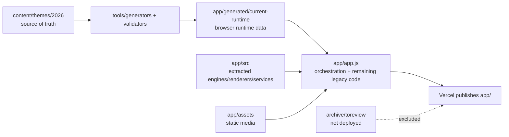

# Current WSC Folder Architecture

Snapshot of the current `/Users/francoismo/Documents/Playground/WSC` folder after the V3 cleanup/deploy work.

This is the real current structure, not the final target architecture. Large generated/vendor/archive folders are summarized where listing every package or image would make the architecture unreadable.

## Top Level

```text
WSC/
  .vercel/                          # Vercel linked project metadata
    README.txt
    project.json                    # Vercel project/org IDs
  app/                              # current published app root; Vercel outputDirectory points here
  archive/                          # quarantined material; not loaded by app/index.html
  content/                          # normalized source-of-truth theme content
  tools/                            # generators and validators
  .gitignore
  .vercelignore                     # excludes archive/build/output/vendor-like junk from Vercel upload
  ARCHITECTURE_TARGET.md            # ideal future architecture
  CURRENT_ARCHITECTURE.md           # this file
  LIVE_MULTIPLAYER_TARGET.md        # live multiplayer target, now Alpacapardy-only for first phase
  PUBLICATION.md
  README.md
  vercel.json                       # Vercel config; publishes app/
```

## Current Runtime App

```text
app/
  index.html                        # browser entry point; loads generated runtime + extracted modules + app.js
  app.js                            # current orchestration/event wiring; still large, but reduced
  styles.css                        # ordered stylesheet import index
  styles-*.css                      # split app shell, route, learn/play/live/raw, and late override chunks
  pwa.js                            # PWA install/service-worker registration behavior
  service-worker.js                 # offline/cache layer
  manifest.webmanifest              # PWA manifest
  supabase-config.js                # public Supabase URL + publishable key
  package.json                      # app scripts: theme validation, smoke test, desktop builds
  package-lock.json

  data.js                           # old runtime data file kept for compatibility comparison
  knowledge-bank.js                 # old runtime knowledge file kept for compatibility comparison
  raw-content-bank.js               # old runtime raw content file kept for compatibility comparison
  alpaca-channel.js                 # old runtime video file kept for compatibility comparison
  assets-config.js                  # old runtime asset file kept for compatibility comparison

  app-icons/                        # PWA/app icons
  assets/                           # active static images/audio used by runtime
  content/                          # legacy content/runtime support files
  desktop/                          # Electron desktop shell/config
  generated/                        # generated browser-ready current runtime
  node_modules/                     # local desktop/build dependencies; not deployed
  src/                              # extracted new source bridge modules
  supabase/                         # SQL setup files
```

## Runtime Load Path

The active published page loads from `app/index.html` in this order:

```text
generated/current-runtime/*.js      # generated data/knowledge/assets/raw content/videos/alpacards
supabase-config.js                  # Supabase public config
src/theme/*.js                      # ID compatibility
src/services/*.js                   # asset, storage, progress, auth, questions, Supabase bridges
src/modes/learn/*.js                # learning modes
src/ui/*.js                         # extracted UI renderers
src/modes/play/*.js                 # play engines/renderers/live reducer
app.js                              # app orchestration and event handlers
pwa.js                              # PWA behavior
```

## Extracted Source Bridge

```text
app/src/
  README.md                         # explains the transition layer
  theme/
    section-ids.js                  # canonical/current section ID bridge
  services/
    asset-service.js                # asset path resolver
    storage-service.js              # localStorage JSON helpers
    progress-service.js             # stat/default progress normalization
    video-service.js                # YouTube URL/embed/preview helpers
    game-question-service.js        # shared question pools/patterns for games
    auth-service.js                 # Supabase auth client helpers
    supabase-profile-service.js     # Alpaccount profile/progress table calls
    raw-content-service.js          # raw-content filtering/mapping/counting
    alpacapardy-live-supabase-service.js # future Supabase calls for live Alpacapardy rooms
  ui/
    auth-modal-renderer.js          # Alpaccount modal rendering
    wizard-renderer.js              # route builder/wizard rendering
  modes/
    learn/
      alpacards/
        alpacards-mode.js           # Alpacard filtering/rendering/navigation
      alpaca-channel/
        alpaca-channel-mode.js      # video/channel rendering/navigation
      mindmap/
        mindmap-mode.js             # mindmap rendering and popups
      regular-guide/
        regular-guide-mode.js       # guide rendering/navigation/question block
      raw-content/
        raw-content-mode.js
        raw-content-entry-renderer.js
        raw-content-media-lightbox.js
        raw-content-quiz-renderer.js
        raw-content-transfer-table.js
        raw-content-mastery.js
        raw-content-visual-assets.js
    play/
      live-session-service.js       # transport-neutral live session shell; supports only Alpacapardy now
      alpaquiz/
        alpaquiz-engine.js          # solo/local quiz planning and scoring
        alpaquiz-renderer.js        # solo/local quiz rendering
      alpacapardy/
        alpacapardy-engine.js       # board/teams/tiles/standings
        alpacapardy-renderer.js     # setup/board/focus/results rendering
        alpacapardy-live.js         # event reducer for future live Alpacapardy
```

## Active Static Assets

```text
app/assets/
  Alpacajump/                       # Alpaca Jump artwork
  audio/
    relay/                          # Relay/alpaquiz local multiplayer sounds
  boards/
    jeopardy/                       # Alpacapardy board art
    wood_sign_svgs/                 # wood sign SVG board assets
  flashcards/
    alpacards/                      # Alpacard images
  footer/                           # footer/header quick-link icons
  icons/
    letters/                        # dynamically loaded letter icons
    ui/                             # UI icons such as sign-in
  loading/                          # startup loader video
  mascot/
    core/                           # active base mascot art referenced by runtime/cache
    library/final-pack/             # active final mascot/UI art pack; unused working files moved to archive
  multiplayer/
    relay/                          # local multiplayer relay assets
  race/                             # Race mode assets
  raw-content/                      # per-section raw content media
    call-of-duty-free/
    concluding-questions/
    going-pains/
    home-and-wandering/
    introductory-questions/
    monkey-see-monkey-prototype/
    more-to-do-than-can-ever-be-listed/
    next-year-in-futurism/
    progress-not-regress/
    the-end-is-nearish/
    the-lovely-and-the-liminal/
    theres-a-draft-in-here/
    were-all-in-this-to-get-there/
    where-the-sidewalk-starts/
    where-were-going-well-still-need-them/
  run/                              # Alpaca Run map/assets
  screens/
    checkpoints/                    # success/fail checkpoint visuals
    hero/                           # hero artwork
```

## Generated Runtime

```text
app/generated/current-runtime/
  data.js                           # generated WSC_DATA
  knowledge-bank.js                 # generated WSC_KNOWLEDGE_BANK
  assets-config.js                  # generated WSC_ASSETS
  raw-content-bank.js               # generated WSC_RAW_CONTENT_BANK; legacy quiz arrays removed
  alpaca-channel.js                 # generated WSC_ALPACA_CHANNEL
  content/
    alpacards.js                    # generated WSC_ALPACARDS
  summary.json                      # generated build summary
```

## Supabase Files

```text
app/supabase/
  alpaccounts.sql                   # current Alpaccount/profile/progress schema repair/setup script
  alpacapardy_live.sql              # future Alpacapardy live sessions/players/events/snapshots schema
```

`alpacapardy_live.sql` has not been applied automatically to Supabase from this machine. It is the reviewed SQL target for the next database step.

## Content Source Of Truth

```text
content/themes/2026/
  theme.json                        # 2026 theme identity
  manifest.json                     # section/theme content map
  aliases.json                      # old ID to canonical ID mapping
  assets.json                       # normalized asset registry
  migration-report.json             # generated migration report
  compat/                           # compatibility snapshots from current legacy runtime
    wsc-data.json
    knowledge-bank.json
    assets-config.json
    raw-content-metadata.json
    raw-section-order.json
    full-voyage-order.json
    alpaca-channel-metadata.json
    alpaca-channel-order.json
    alpacards-order.json
  generated/                        # generated indexes from source content
    assets.index.json
    channel-videos.index.json
    alpacards.index.json
  questions/
    README.md
    question-bank.json              # central question source of truth
    question-bank.csv               # human-review export
  theme-wide/
    alpacards.json                  # theme-wide alpacards
    channel-videos.json             # theme-wide videos
  sections/
    {section-id}/
      section.json                  # section metadata
      raw-content.json              # section raw content entries
      questions.json                # section question placements/source extraction
      guide.json                    # regular guide metadata
      guide.html                    # generated guide HTML
      media.json                    # section media references
      alpacards.json                # section-owned alpacards
      channel-videos.json           # section-owned videos
```

Current 2026 section folders:

```text
call-of-duty-free
concluding-questions
going-pains
home-and-wandering
introductory-questions
monkey-see-monkey-prototype
more-to-do-than-can-ever-be-listed
next-year-in-futurism
progress-not-regress
the-end-is-nearish
the-lovely-and-the-liminal
theres-a-draft-in-here
were-all-in-this-to-get-there
where-the-sidewalk-starts
where-were-going-well-still-need-them
```

## Tools

```text
tools/
  generators/
    extract-current-2026-theme.mjs
    build-question-bank-from-theme.mjs
    build-current-runtime-from-theme.mjs
  validators/
    validate-theme.mjs
    compare-runtime-compat.mjs
    smoke-test-app.mjs
```

Current important app scripts in `app/package.json`:

```text
npm run theme:extract
npm run theme:build-question-bank
npm run theme:validate
npm run theme:build-runtime
npm run theme:compare
npm run theme:compare:strict
npm run theme:compare:legacy-audit
npm run theme:refresh
npm run test:theme
npm run test:smoke
```

## Archive / Quarantine

```text
archive/toreview/
  README.md
  2026-05-17-runtime-unused/        # files already moved out of active runtime
  2026-05-17-nonruntime-folders/    # old root non-runtime folders moved out of the project root
    v2-lock/                        # old V2 locked source/build material
    references/                     # reference material
    outputs/                        # generated source-truth spreadsheets
    output/                         # Playwright screenshots/test artifacts
    exports/                        # exported/promo material
  2026-05-17-desktop-builds/        # generated Electron/macOS/Windows build outputs
    builds/
      current/
        mac-arm64/                  # packaged macOS app output
        win-unpacked/               # unpacked Windows/Electron app output
          locales/                  # Chromium language packs, not WSC content
        *.exe                       # Windows installer/portable generated outputs
  2026-05-17-unused-mascot-assets/  # mascot images not referenced by app/content/tools scan
    app/assets/mascot/
  2026-05-17-generated-artifacts/   # generated output copies and audit reports
    dist/                           # generated runtime copy; can be regenerated
    reports/                        # generated reports/audits
  2026-05-17-deep-clean/            # second-pass full-folder cleanup
    unused-assets/                  # app assets/content files not referenced by app/content/tools scan
    dev-oneoffs-and-legacy/         # one-off scripts, old app README, old debate/game files, .nojekyll
    github-pages-legacy/            # old GitHub Pages workflow; Vercel is active now
    system-metadata/                # .DS_Store and unused .gitkeep placeholders
  wsc-2026-study-routes-nested-clone/ # old nested repo copy; not loaded by current app
```

This is excluded from Vercel by `.vercelignore`.

## Current Reality In One Diagram



## Important Current Notes

- The app is still published from `app/`, not from a future `apps/web/` folder yet.
- The normalized 2026 source of truth is now `content/themes/2026/`.
- The generated browser runtime used online is `app/generated/current-runtime/`.
- The old runtime files in `app/data.js`, `app/raw-content-bank.js`, etc. are still present mostly for compatibility checks.
- `app/app.js` is still the main orchestrator, but many renderers/services have been extracted to `app/src/`.
- Live multiplayer preparation is scoped to Alpacapardy only.
