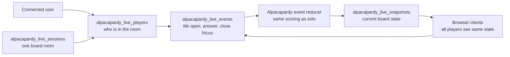
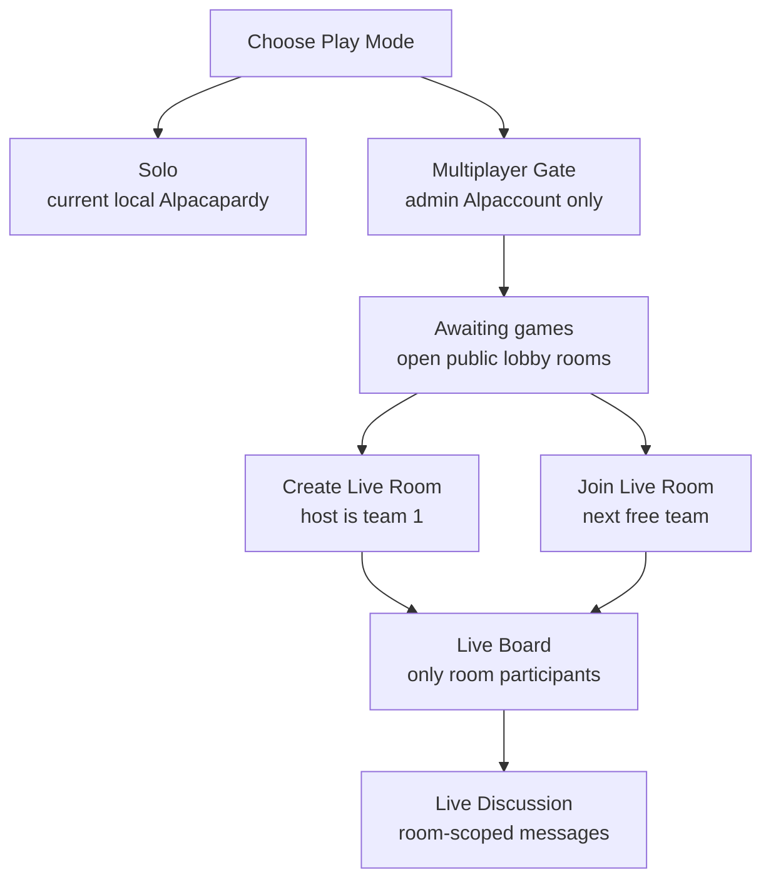

# Live Multiplayer Target

This is the target bridge from the cleaned solo app to future online live play.

## Current Clean Path

```mermaid
flowchart LR
  QuestionBank["content/themes/2026/questions/question-bank.json\nQuestion source of truth"]
  Runtime["app/generated/current-runtime\nBrowser compatibility runtime"]
  QuestionService["app/src/services/game-question-service.js\nBuilds pools and question sequences"]
  AlpacapardyEngine["app/src/modes/play/alpacapardy/alpacapardy-engine.js\nBoard, teams, standings"]
  AlpacapardyLive["app/src/modes/play/alpacapardy/alpacapardy-live.js\nEvent reducer for live board state"]
  Renderers["Mode renderers\nHTML and UI state"]
  App["app/app.js\nOrchestration and event wiring"]

  QuestionBank --> Runtime
  Runtime --> QuestionService
  QuestionService --> AlpacapardyEngine
  AlpacapardyEngine --> AlpacapardyLive
  AlpacapardyEngine --> Renderers
  AlpacapardyLive --> Renderers
  Renderers --> App
```

## Future Live Path

## Rules

- The question source of truth stays in `content/themes/{year}/questions/question-bank.json`.
- Game engines must stay transport-agnostic: no DOM, no Supabase, no localStorage.
- Renderers display a state snapshot; they should not decide scoring rules.
- Realtime multiplayer should store events first, then derive snapshots from those events.
- Alpacapardy is the first live crash test because board turns, teams, rooms, and scoring map naturally to events.
- Alpaquiz is intentionally not part of this live phase. It stays solo/local until Alpacapardy is stable online.
- Solo and Multiplayer are separate launch paths. Solo must keep working with no Supabase dependency.
- Multiplayer is temporarily admin-gated to `moretfrancoisea@gmail.com`, `francois.moret@ilg-ks.org`, and `frenchease.admin@gmail.com`.
- Guest play will use Supabase anonymous users later, but guests do not get persistent dashboard/progress writes.
- Alpaccounts keep persistent dashboard/progress via `alpaca_profiles` and `alpaca_progress`.
- Live discussion is room-scoped only and travels through `alpacapardy.chat_message` events.

## Current Build Step

The first transport-neutral `live-session-service.js` now exists and can:

- create a session shell for `alpacapardy`
- add/remove players
- append game events
- expose a serializable public session snapshot
- later swap the storage layer from local mock data to Supabase Realtime

The Alpacapardy-specific bridge now exists:

- `app/src/modes/play/alpacapardy/alpacapardy-live.js` reduces board events into a shared state.
- `app/src/services/alpacapardy-live-supabase-service.js` wraps the future Supabase table calls.
- `app/supabase/alpacapardy_live.sql` defines sessions, players, events, snapshots, RLS, and Realtime publication wiring.

## Current Crash Test UX

## Implemented Live Actions

- Host creates a public lobby room for Alpacapardy.
- Players join one-per-team, up to the selected 2-4 player cap.
- Host controls setup and starts the board.
- Current team/player opens a tile, answers, and returns to board.
- Host leaving a started game emits a forfeit event and closes the room.
- Host disconnecting stops the room from appearing in the public lobby after the heartbeat window.
- Non-admin users see `Available soon` instead of live multiplayer controls.
