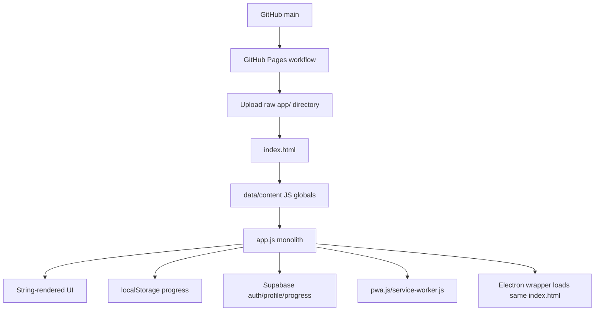

# WSCapp GitHub Architecture And Product Audit

Audit date: 2026-06-16  
Audit source: GitHub remote `https://github.com/proffrancois-cloud/wsc-2026-study-routes.git`  
Branch and commit: `main` at `8ed06ee7c97b91cdfdc18fec05c2c4eec9efde38` (`Add Alpacard flashcards`)  
Local clean audit checkout: `/tmp/wsc-github-audit`  
Scope constraint: GitHub source only. Not Vercel. Not the dirty local workspace. Not unpushed refactors.

## Important Correction

The recent lifecycle/timer cleanup I did earlier in the local WSC workspace was not verified as pushed to GitHub. This audit is based only on GitHub `main` at commit `8ed06ee7c97b91cdfdc18fec05c2c4eec9efde38`.

That matters because GitHub `main` still has the older static app shape:

- No `app/src`.
- No `generated/current-runtime`.
- No root `tools` layer.
- Main runtime is the large browser-global `app/app.js`.
- GitHub Pages deploys the raw `app/` directory directly.

## Specialist Inputs

This coordinator report synthesizes eight specialist passes:

- Architecture and runtime.
- UI, frontend UX, and design systems.
- WSC curriculum, content relevance, and pedagogy.
- Growth, community, viral loops, and marketing.
- Multiplayer, social learning, and retention.
- Data, analytics, monetization, and experimentation.
- Performance, PWA, offline, and platform reliability.
- Security, privacy, compliance, and student safety.

## Executive Verdict

WSCapp is not just a small revision mini-site anymore. In GitHub `main`, it is already a substantial free WSC 2026 study game hub: Learn/Play routing, 15 guiding sections, knowledge bank, raw study content, Alpacards, Alpaca Channel videos, local multiplayer modes, progress stats, PWA shell, and Electron wrapper.

The product idea is strong. The "Are We There Yet?" route metaphor is memorable and fits WSC perfectly: checkpoints, Yale, teams, progress, waiting, destinations, and playful challenge loops.

The architecture is not ready for fame yet.

The app can become the best free WSC app, but the next work should not be random feature addition. The correct sequence is:

1. Trust and launch safety.
2. Reproducible GitHub architecture.
3. Modular runtime contracts.
4. Performance and offline reliability.
5. UI clarity and design-system maturity.
6. Adaptive learning and content quality.
7. Share loops, classroom loops, analytics, and monetization.

The most important product principle: make it free for students, but valuable enough that sponsors, schools, coaches, grants, workshops, or ethical partners fund it.

## Current GitHub Architecture

The app is a static browser app published from `app/` through GitHub Pages.

Key files:

- `.github/workflows/pages.yml`: deploys `app` as the Pages artifact with no build/test/validation step.
- `app/index.html`: loads all runtime and data scripts as ordered globals.
- `app/app.js`: 12,646-line main runtime.
- `app/styles.css`: 6,298-line global stylesheet.
- `app/raw-content-bank.js`: 21,332-line generated content global.
- `app/alpaca-channel.js`: 17,371-line generated video/catalog global.
- `app/game-question-pack.js`: generated questions, mutates `window.WSC_DATA.questions`.
- `app/knowledge-bank.js`: expanded knowledge bank.
- `app/content/alpacards.js`: flashcard catalog.
- `app/pwa.js` and `app/service-worker.js`: hand-managed PWA behavior.
- `app/desktop/electron/main.js`: thin Electron file wrapper around `index.html`.
- `app/supabase/alpaccounts.sql`: profile and progress tables.

Static shape:



## Hard Evidence

Important findings from the clean GitHub checkout:

- `app/app.js` reads global data immediately at line 1 and owns app/auth/game state around line 2070.
- `app/app.js` registers document-level click, submit, keydown, touchstart, and touchend handlers around lines 2186-2199.
- `handleClick` is a long command router covering auth, resources, route selection, raw content, slides, cards, race, jump, build-case, Alpacapardy, Relay, Run, and close behavior around lines 2202-2630.
- Experience launch and rendering are large mode switch chains around lines 3514-3592.
- Timer lifecycle is shared through globals and `clearJeopardyTimer()` clears Run, Race, Relay, and Jump timers too around lines 2147-2183.
- Supabase auth and progress logic sit inside `app.js` around lines 3895-4155 and 11356-11420.
- `app/index.html` loads Vercel Insights despite GitHub Pages publication around line 34.
- `app/index.html` loads Supabase from `https://cdn.jsdelivr.net/npm/@supabase/supabase-js@2` around line 35.
- `app/index.html` loads all content/runtime scripts synchronously around lines 102-111.
- `app/package.json` has serve and Electron scripts, but no test, lint, typecheck, validation, or build gate.
- `app/scripts` includes many one-off content scripts with absolute local DOCX paths.
- `app/assets` is about 257 MB, with 789 files and multiple individual images above 7-15 MB.
- The service worker precaches icons and selected media, but not the full boot shell (`styles.css`, `app.js`, `data.js`, `raw-content-bank.js`, `pwa.js`, etc.).
- `alpaccounts.sql` grants anonymous execution on a username-to-email resolver.

## P0 Launch Gates

These should be fixed before trying to make the app widely famous.

### 1. Student Privacy And Trust

GitHub `main` collects account data: email, alpaca name, country, school name, WSC event count, and highest WSC round. There is no visible privacy notice, terms, age gate, parental/teacher consent flow, retention policy, data deletion/export path, or third-party disclosure in the app.

Requirement:

- Add privacy policy, terms, student safety policy, and contact/controller identity.
- Minimize signup data. Make school/country optional or teacher-managed.
- Separate progress sync from analytics consent.
- Add account deletion/export.
- Add clear disclosure for Supabase, YouTube, Google Fonts, any analytics, localStorage, PWA cache, and external links.
- Do not scale public student accounts until this exists.

### 2. Supabase Auth Safety

`resolve_alpaca_login` returns email addresses and is granted to `anon`. This creates username/email enumeration risk. Authenticated users also have broad update access on their own profile row.

Requirement:

- Remove anonymous email resolution, or move username login behind a rate-limited server/Edge Function that never returns email.
- Tighten grants and column updates.
- Make email immutable/sync-only.
- Add RLS denial tests.
- Add rate limits and JSON size limits.

### 3. Copyright And Asset Rights

The app bundles many exact third-party artworks/site images. Some entries have `rightsNote: "Use exact image; do not generate"` but not a final license/permission classification. There is no repo-level license/notice/privacy/terms file.

Requirement:

- Create an asset rights manifest for every bundled image/audio/video thumbnail.
- Track source, author, license, permission, distribution rights, attribution, and review status.
- Replace unresolved assets with public-domain/permissive assets, generated educational images where appropriate, or link-only cards.

### 4. GitHub CI Quality Gate

GitHub Pages deploys raw `app/` with no checks.

Requirement:

- Add CI smoke test for app load.
- Add script/global presence validation.
- Add content schema validation.
- Add asset-reference validation.
- Add service-worker install/offline validation.
- Add link and rights checks.
- Add file-size budgets.

### 5. Offline PWA Correctness

The PWA can be installed before the full boot shell is cached under service-worker control. A fresh installed app can fail offline.

Requirement:

- Precache the real critical boot set.
- Generate cache manifests from the deployed files.
- Add an offline Playwright smoke test: install service worker, go offline, reload, launch a core route.

## Core Architecture Diagnosis

### What Is Strong

- The app already has a unique WSC-specific identity.
- The content breadth is serious: 15 sections, raw entries, knowledge atoms, videos, Alpacards, and game questions.
- Learn/play modality spread is strong.
- PWA and desktop wrappers create distribution options.
- Supabase account/progress gives a base for persistence.
- The route metaphor is unusually aligned with the WSC 2026 theme.

### What Is Fragile

- The deployed app is also the source artifact.
- Content is executable JS globals, not validated data.
- `app.js` mixes shell, rendering, games, auth, progress, content normalization, timers, assets, and media.
- `styles.css` is global and very broad.
- Modes are switch chains rather than modules with contracts.
- Timers are client-local and mode-coupled.
- Content tooling is not reproducible from GitHub alone.
- Runtime services are deployment-coupled: Vercel script in GitHub Pages, Supabase CDN, Google Fonts, YouTube iframes.
- No test/validation scripts exist.

## Target Architecture

The best next architecture is not a full framework rewrite. It is a source/runtime split with explicit contracts.

Recommended layers:

```text
content/
  themes/wsc-2026/
    sections.json
    atoms.json
    questions.json
    alpacards.json
    videos.json
    sources.json
    assets-manifest.json

tools/
  generators/
  validators/
  migrations/

app/src/
  shell/
  lifecycle/
  services/
  modes/
    slideshow/
    mindmap/
    raw-content/
    alpaca-channel/
    alpacards/
    quiz/
    alpacapardy/
    run/
    race/
    jump/
    relay/
    build-case/
  design-system/

app/generated/current-runtime/
  manifest.json
  content-index.json
  route-chunks/
  asset-manifest.json

app/
  index.html
  assets/
  service-worker.js
  pwa.js
```

Minimum runtime contracts:

- Mode contract: `id`, `label`, `availability`, `buildState`, `render`, `handleAction`, `timerPolicy`, `resultPolicy`.
- Content contract: canonical IDs, citations, source status, rights status, difficulty, route tags.
- Asset contract: source, license, optimized variants, dimensions, thumbnail, cache policy.
- Progress contract: attempt event, mastery state, aggregate stats, sync conflict rule.
- Analytics contract: consent-gated, allowlisted events only.

## Product North Star

The best WSCapp should be:

- Free for students.
- Fast on phones and school Wi-Fi.
- Safe and privacy-respecting for minors.
- Trusted by coaches and parents.
- Deeply aligned with WSC official themes, but clearly unofficial unless permission exists.
- Fun enough for students to share.
- Structured enough for teachers/coaches to use in class.
- Rich enough to help students genuinely improve, not only play.
- Monetized through sponsors, schools, grants, workshops, ethical partnerships, or optional merch, not student paywalls.

Suggested positioning:

> The free, unofficial WSC 2026 route map: learn the theme, play team games, and see how close you can get to Yale.

Trust line:

> Free for scholars. Built around official theme sources. Not affiliated with or endorsed by WSC unless permission is granted.

## UI And Design Requirements

The current UI is memorable and charming, but not yet clear enough for mass adoption.

P0 requirements:

- On mobile 390x844, the primary start action should be visible without scrolling.
- Restore route/mode card descriptions and add "best for" cues.
- Separate student tasks from coach/classroom tasks.
- Hide unavailable modes or label them before launch.
- Add proper dialog accessibility: name, close control, Escape, focus trap, inert background, focus restoration.
- Fix contrast issues and unresolved CSS variables such as `--muted`.
- Add `prefers-reduced-motion` coverage.

P1 requirements:

- Extract design primitives: `Button`, `IconButton`, `ChoiceCard`, `Dialog`, `GameSetup`, `GameBoard`, `StatCard`, `QuestionOption`, `EmptyState`.
- Create explicit tokens for color roles, typography, spacing, radius, elevation, z-index, focus, and motion.
- Redesign progress rail for mobile.
- Add route deep links and shareable game/result states.
- Generate image thumbnails and responsive variants.

Best-in-class surfaces:

- Student home: Continue studying, Practice 5 questions, Play a challenge, Review weak areas.
- Coach home: Start projector game, Create teams, Share join code, Pick section, Export results.
- Game result: shareable recap card with route, score, weak areas, next action, and privacy-safe link.

## Content And Pedagogy Requirements

The content is the app's crown jewel, but trust and adaptivity are missing.

Current content scale reported by specialist audit:

- 15 guiding sections.
- 107 raw entries.
- 521 raw level 1-5 quiz questions.
- 95 knowledge-bank atoms.
- 440 playable app questions after generation.
- 85 Alpacards.
- 135 Alpaca Channel videos.

P0 requirements:

- Canonicalize section IDs across raw content, cards, videos, questions, and generated routes.
- Add `validate:content` and run it in CI.
- Bind every atom/question/card/video to citations and source quality.
- Fix subject/big-idea route filtering so play modes do not pull irrelevant questions.
- Add image/video rights review states.
- Make content generation reproducible from committed source truth.
- Update stale docs, including "60 multiple-choice questions" in `app/README.md`.

P1 requirements:

- Diagnostic pretest -> study route -> adaptive quiz -> remediation -> transfer task.
- Mastery by knowledge atom, not only raw-entry toggles.
- Spaced repetition for missed questions and Alpacards.
- WSC-style transfer prompts: apply, compare, debate claim, explain.
- Upgrade Build Your Case into structured debate practice with claim, warrant, evidence, rebuttal, feedback, and rubric score.

P2 requirements:

- WSC knowledge graph connecting sections, subjects, big ideas, examples, cards, videos, questions, and debates.
- Difficulty calibration from real performance data.
- Official syllabus diffing and freshness alerts.
- Curator workflow with correction SLA and release notes.

## Multiplayer, Social Learning, And Retention

GitHub `main` does not have networked live multiplayer. It has same-device team play.

Current state:

- Alpacapardy: local board, 2-4 teams, local turn timer and score.
- Relay/Alpaquiz: same-keyboard buzz mode, local score award.
- Run/Race/Jump: solo timed/challenge modes.
- Supabase: auth/profile/progress only, not rooms/presence/realtime/live match state.

Risks:

- No server-authoritative timers.
- No server timestamp for buzzes.
- No participant identity.
- No event log or replay.
- No reconnect/dispute model.
- `Math.random()` question order is not reproducible.
- Best team score persistence can prefer Team 1 instead of actual winner in some result paths.

P0 requirements:

- Fix best team score persistence.
- Define first-class solo Quiz separately from Relay/Alpaquiz.
- Add attempt history instead of only aggregate JSON stats.
- If building remote play, use event-sourced sessions, server time, transactional buzz/answer RPCs, Realtime broadcasts, reconnect, and replay.

P1 classroom requirements:

- Classrooms.
- Class members.
- Teams.
- Assignments.
- Live sessions.
- Session participants.
- Session events.
- Answers.
- Scores.
- Leaderboard entries.
- Exportable coach reports.

Retention loops:

- Daily/weekly study quests.
- Weak-area review.
- Come-back-to-finish route recovery.
- Team rematches.
- Class challenges.
- Private leaderboards.
- Seasonal opt-in tournaments.

## Analytics, Metrics, And Experimentation

Current state: progress persistence, not analytics.

Existing progress:

- Sessions.
- Total answered.
- Total correct.
- Best accuracy.
- Best streak.
- Best mode scores.
- Raw mastery flags.
- LocalStorage and optional Supabase `alpaca_progress`.

Missing:

- First-party event log.
- Funnel tables.
- Experiment assignments.
- Consent surface.
- Learning outcome events.
- Sponsor/placement measurement.

P0 analytics requirements:

- Remove/disable Vercel Insights for GitHub Pages.
- Add consent and privacy settings.
- Add first-party allowlisted event wrapper.
- Add `analytics_events` table with minimal, non-sensitive properties.
- Do not send email, alpaca name, school, free text, exact country, or direct identifiers into analytics.

Core events:

- `app_opened`
- `route_path_selected`
- `lens_selected`
- `target_selected`
- `mode_selected`
- `experience_started`
- `question_answered`
- `experience_completed`
- `raw_mastery_toggled`
- `resource_opened`
- `video_opened`
- `signup_started`
- `signup_completed`
- `pwa_install_prompt_seen`
- `pwa_install_accepted`

Key funnels:

- Visitor to first learning value.
- Play mode start to completion.
- Account conversion to progress sync.
- PWA install adoption.
- Content engagement to mastery.

## Monetization Without Charging Users

Best-fit monetization options:

1. School/team sponsorship packages.
2. Grants or institution-funded free access.
3. Sponsored route packs or branded challenges, clearly labeled and educational.
4. Ethical resource marketplace or partner links, with disclosure.
5. Paid setup/workshops/private hosting for schools and coaches.
6. Optional merch or printable club kits.
7. Alumni/community sponsorship.

Avoid:

- Student paywalls.
- Paid performance boosts.
- Selling student data.
- Targeted ads to minors.
- Public leaderboards exposing school/country without consent.
- Dark-pattern streak pressure.

## Growth And Marketing Strategy

The growth engine should be product-led, not ad-led.

P0:

- Clarify hero copy and README positioning.
- Add unofficial/free/privacy/source trust language.
- Fix install CTA visibility.
- Add route deep links.
- Add shareable result cards.
- Add Discord/GitHub feedback flows with student safety controls.
- Add social preview metadata.

P1:

- Club/teacher host kit.
- Classroom QR flow.
- Weekly challenge prompts.
- "Can you reach Yale?" share format.
- Private school/team leaderboards.
- Contributor workflow for corrections, videos, and cards.
- GitHub Releases for desktop builds.

P2:

- Remote multiplayer rooms.
- Seasonal global challenges.
- Coach dashboards.
- Localization.
- Public content API/export.
- Ethical sponsor program.

## Performance And Platform Requirements

Current metrics:

- `app/`: about 265 MB.
- `app/assets`: about 257 MB.
- 789 asset files.
- First-party boot shell: about 3.26 MiB uncompressed.
- Largest JS/content files: `raw-content-bank.js` about 1.60 MB, `alpaca-channel.js` about 542 KB, `app.js` about 458 KB, `game-question-pack.js` about 383 KB.
- Service-worker precache: about 15.9 MB, but excludes core boot JS/CSS/data.

P0:

- Generate PWA cache version from Git commit.
- Precache the full critical shell.
- Add offline smoke test.
- Remove Vercel Insights reference.

P1:

- Lazy-load content banks by route/mode.
- Split raw content/video/card data into route chunks.
- Switch versioned files to cache-first or stale-while-revalidate with timeout fallback.
- Generate thumbnails, WebP/AVIF, dimensions, and `srcset`.
- Add Cache Storage size/LRU policy.
- Pin or self-host Supabase and fonts.

P2:

- Better update UX instead of forced reload.
- Guard localStorage writes against quota/private-mode failures.
- Harden Electron: sandbox where feasible, protocol allowlist, packaged smoke tests.

## Security And Safety Requirements

Immediate:

- Disable or gate public signup until privacy/consent is implemented.
- Remove or interstitial direct Discord/Reddit handoff from student-first UI.
- Remove anonymous username-to-email resolution.
- Add privacy/terms/student safety pages.
- Add deletion/export workflow.
- Add CSP and SRI/self-hosting.
- Use click-to-load video embeds or `youtube-nocookie.com`.

Near-term:

- Column-level Supabase grants.
- RLS tests.
- Server-side profile validation.
- Stronger password requirements.
- Rate-limited RPC and password reset.
- External link protocol allowlist.
- Asset/license audit.

## PR Roadmap

### PR 1: GitHub Audit Hardening

Goal: make GitHub `main` deployable with confidence.

- Remove Vercel Insights reference.
- Add test/validation scripts.
- Add Pages workflow gates.
- Validate required files and globals.
- Validate service-worker cache paths.
- Validate asset references.
- Add baseline smoke test.

### PR 2: Trust And Student Safety Gate

Goal: safe public student use.

- Add privacy, terms, student safety, and third-party disclosure.
- Disable/gate signup until consent flow exists.
- Remove anonymous email resolver.
- Tighten Supabase grants.
- Add deletion/export path.
- Add external community interstitial or remove direct student-facing links.

### PR 3: Content Source Of Truth

Goal: reproducible content from GitHub.

- Create committed `content/themes/wsc-2026` source data.
- Replace one-off absolute-path scripts with one configurable generator.
- Add schema validators.
- Add source/citation/rights manifest.
- Generate current browser globals as compatibility output.

### PR 4: Runtime Mode Registry

Goal: stop growing `app.js` switch chains.

- Add mode registry.
- Move mode metadata, availability, state builders, renderers, and actions behind contracts.
- Keep current UI behavior where possible.
- Add smoke coverage per mode.

### PR 5: Lifecycle And Timer Controller

Goal: make timers and close cleanup explicit.

- Extract startup tasks.
- Extract event bindings.
- Extract experience close cleanup.
- Extract timer cleanup.
- Move `syncExperienceTimers` and Jump/Race/Run/Relay/Alpacapardy timer coordination into one lifecycle controller.

This is related to the earlier local cleanup idea, but it must be re-applied or cherry-picked against GitHub `main` if it is not already pushed.

### PR 6: PWA And Performance

Goal: fast, installable, reliable.

- Generate cache manifest/version.
- Full critical shell precache.
- Offline smoke test.
- Lazy-load content.
- Add asset budgets.
- Add thumbnail pipeline.

### PR 7: Design System And Mobile First UX

Goal: make the app instantly understandable.

- Rework first mobile viewport.
- Restore card descriptions.
- Add design tokens.
- Add accessible dialog primitive.
- Add reduced-motion handling.
- Fix contrast and unresolved variables.

### PR 8: Progress, Attempts, And Analytics

Goal: learn what works without violating trust.

- Add attempt history.
- Add consent-gated first-party analytics.
- Add event taxonomy.
- Add funnel views.
- Add privacy-safe dashboards.

### PR 9: Adaptive Learning

Goal: make students improve.

- Mastery by atom.
- Missed-question review.
- Spaced repetition.
- Alpacard recognition history.
- Transfer tasks.
- Build Your Case rubric.

### PR 10: Classroom And Share Loops

Goal: growth through actual classroom usefulness.

- Route deep links.
- QR classroom challenge.
- Shareable result cards.
- Projector-friendly Alpacapardy.
- Teacher host kit.
- Private class/team leaderboards.

### PR 11: Remote Multiplayer Foundation

Goal: fair live play when ready.

- Live sessions.
- Join codes.
- Participant identity.
- Event log.
- Server-time timers.
- Transactional buzz/answer RPCs.
- Reconnect/replay.

## 30/60/90 Day Plan

### First 30 Days: Make It Safe And Stable

- GitHub CI gates.
- Privacy/terms/student safety.
- Remove Vercel reference.
- Fix Supabase enumeration risk.
- Fix PWA offline boot.
- Add content validation.
- Add asset rights manifest.
- Clarify hero/README positioning.

### Days 31-60: Make It Clear And Modular

- Mode registry.
- Lifecycle/timer controller.
- Design-system primitives.
- Mobile first-viewport fix.
- Lazy-loaded content chunks.
- Route deep links.
- Shareable result cards.
- Attempt history.

### Days 61-90: Make It Famous And Fundable

- Adaptive learning loop.
- Classroom/projector mode.
- Teacher host kit.
- Weekly challenges.
- Private class/team leaderboards.
- Consent-gated analytics dashboards.
- Sponsor/grant package.
- Public launch campaign.

## What Not To Do

- Do not rewrite the whole app in React/Vite before creating module boundaries.
- Do not add more modes into the current monolithic `handleClick` and render switch chains.
- Do not grow public users before privacy and safety are credible.
- Do not treat same-keyboard Relay as true live multiplayer.
- Do not cache all 257 MB of assets indiscriminately.
- Do not manually edit generated content blobs as the long-term workflow.
- Do not use Vercel analytics if the strategy is GitHub-only and privacy-first.
- Do not monetize by charging students or selling student data.

## Final Coordinator Recommendation

The app's advantage is not technology yet. It is taste, content, and WSC specificity. The architecture should protect that advantage.

The best path is a staged transformation:

1. Make GitHub `main` safe, reproducible, and testable.
2. Extract source/runtime/content contracts.
3. Modularize modes and lifecycle.
4. Improve mobile UX and design-system quality.
5. Add adaptive learning and trustable citations.
6. Add share/classroom loops.
7. Add privacy-safe analytics and ethical monetization.

If this sequence is followed, WSCapp can become the free WSC 2026 study hub students actually use, coaches trust, clubs share, and sponsors can support without charging the learners.
