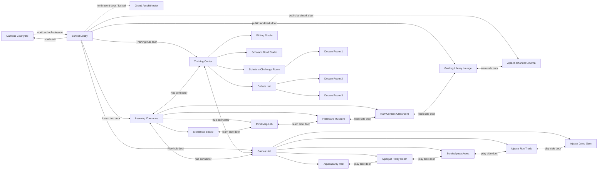

# Alpaca Campus Spatial Door Plan

This is the source-of-truth campus layout for placing portals, doors, spawn points, and room backgrounds. It keeps the campus legible at scale and prevents specialist-room assets from leaking into unrelated rooms.

Editable FigJam board with all 24 rooms:
https://www.figma.com/board/YZmGfjG0PjOUyR5xBWmo3j?utm_source=chatgpt&utm_content=edit_in_figjam&oai_id=&request_id=f66fe0bd-79e2-41d8-bdac-e53d84581b5a

Earlier working board:
https://www.figma.com/board/YUtKJICwJW333glxzByuTe

## Core Principle

The campus should not be one lobby with every possible door. It should work like a real campus:

- `campus-courtyard` is the outdoor arrival and social area.
- `school-lobby` is the central reception hub, with direct doors to the landmark public rooms.
- `guiding-library-lounge`, `alpaca-channel-cinema`, and `grand-amphitheater` are direct School Lobby destinations.
- `learning-commons`, `training-center`, and `games-hall` are the three major mode hubs.
- `training-center` sits spatially between Learn and Play.
- The three major mode hubs are connected to each other, so users can move hub-to-hub without always returning to the lobby.
- `learning-commons` owns the internal Learn rooms, but Library and Cinema are not hidden behind it.
- `games-hall` owns Play rooms, with side doors between related games.
- `debate-lab` owns the small debate rooms.

This keeps the lobby important, gives each wing a purpose, and makes it easier to place doors consistently in generated backgrounds.

## Campus Graph

## Door Placement By Room

| Room | Door placement rule |
|---|---|
| `campus-courtyard` | One large school entrance at the north/upper center, returning into `school-lobby`. Keep sports court, swings, and gathering area as social objects, not room portals. |
| `school-lobby` | Direct doors to Courtyard, Learning Commons, Training Center, Games Hall, Guiding Library Lounge, Alpaca Channel Cinema, and Grand Amphitheater. |
| `learning-commons` | Learn hub. Doors to Slideshow Studio, Mind Map Lab, Flashcard Museum, Raw Content Classroom, Training Center, Games Hall, and School Lobby. |
| `games-hall` | Play hub. Doors to all Play rooms, plus Learning Commons, Training Center, and School Lobby. |
| `training-center` | Bridge hub between Learn and Play. Doors to Learning Commons, Games Hall, School Lobby, Writing Studio, Scholar's Bowl Studio, Scholar's Challenge Room, and Debate Lab. |
| `debate-lab` | Debate-specific lobby. Doors to Debate Room 1, Debate Room 2, Debate Room 3. |
| `grand-amphitheater` | Locked/event shell. Door returns to School Lobby. |

## Exact Door Inventory

These are the room-to-room doors the runtime should expose. Every entry should have a matching return spawn point in the destination room.

| Source room | Doors |
|---|---|
| `campus-courtyard` | School Entrance -> `school-lobby` |
| `school-lobby` | Courtyard -> `campus-courtyard`; Alpaca Channel Cinema -> `alpaca-channel-cinema`; Guiding Library Lounge -> `guiding-library-lounge`; Grand Amphitheater -> `grand-amphitheater`; Learning Commons -> `learning-commons`; Training Center -> `training-center`; Games Hall -> `games-hall` |
| `learning-commons` | School Lobby -> `school-lobby`; Training Center -> `training-center`; Games Hall -> `games-hall`; Slideshow Studio -> `slideshow-studio`; Mind Map Lab -> `mind-map-lab`; Flashcard Museum -> `flashcard-museum`; Raw Classroom -> `raw-content-classroom` |
| `games-hall` | School Lobby -> `school-lobby`; Learning Commons -> `learning-commons`; Training Center -> `training-center`; Alpacapardy Hall -> `alpacapardy-hall`; Alpaca Run Track -> `alpaca-run-track`; Alpaca Jump Gym -> `alpaca-jump-gym`; Alpaquiz Relay Room -> `alpaquiz-relay-room`; Survivalpaca Arena -> `survivalpaca-arena` |
| `training-center` | School Lobby -> `school-lobby`; Learning Commons -> `learning-commons`; Games Hall -> `games-hall`; Writing Studio -> `writing-studio`; Scholar's Bowl Studio -> `scholars-bowl-studio`; Challenge Room -> `scholars-challenge-room`; Debate Lab -> `debate-lab` |
| Learn side doors | Slideshow Studio <-> Mind Map Lab; Mind Map Lab <-> Flashcard Museum; Flashcard Museum <-> Raw Content Classroom; Raw Content Classroom <-> Guiding Library Lounge; Guiding Library Lounge <-> Alpaca Channel Cinema |
| Play side doors | Alpacapardy Hall <-> Alpaquiz Relay Room; Alpaquiz Relay Room <-> Survivalpaca Arena; Survivalpaca Arena <-> Alpaca Run Track; Alpaca Run Track <-> Alpaca Jump Gym |
| `debate-lab` | Training Center -> `training-center`; Debate Room 1 -> `debate-room-1`; Debate Room 2 -> `debate-room-2`; Debate Room 3 -> `debate-room-3` |
| Specialist Learn rooms | Return door to their hub or adjacent Learn room according to the side-door chain |
| Specialist Play rooms | Return door -> `games-hall` |
| Specialist Train rooms | Return door -> `training-center` |
| Debate Rooms 1-3 | Return door -> `debate-lab` |
| `grand-amphitheater` | Return door -> `school-lobby` |

## Lobby Door Rule

The School Lobby is allowed to have direct doors to:

- `campus-courtyard`
- `learning-commons`
- `training-center`
- `games-hall`
- `guiding-library-lounge`
- `alpaca-channel-cinema`
- `grand-amphitheater`

It should not directly expose every specialist classroom or every debate room. Flashcards, raw content, slideshow, mind map, writing, bowl, challenge, and debate rooms remain inside their wing flow.

## Background Generation Guidance

When generating room backgrounds, draw visible doors only for the room's own graph edges:

- Courtyard background: one obvious school entrance.
- Lobby background: Courtyard exit, Learn, Training, Play, Library, Cinema, Event.
- Learning Commons background: Slideshow, Mind Map, Flashcards, Raw Content, plus doors to Training and Games.
- Games Hall background: five Play-room doors, plus doors to Learning and Training.
- Training Center background: Writing, Bowl, Challenge, Debate Lab, plus doors to Learning and Games.
- Debate Lab background: three small debate room doors.

Do not draw Flashcard Museum, Raw Classroom, Slideshow, Mind Map, or Debate Room doors inside the School Lobby. Do draw Library, Cinema, and Grand Amphitheater as direct Lobby landmarks. Do not draw swings, courtyard boards, or school entrance objects inside indoor rooms.

## Scale Guidance

The campus should support 300+ players by spreading them across room-specific channels, not by rendering every user in one giant room. Use this scale model:

- Very large social rooms: Courtyard, School Lobby, Games Hall, Grand Amphitheater.
- Large learning hubs: Learning Commons, Guiding Library Lounge.
- Medium specialist rooms: Museum, Cinema, Classroom, Training rooms.
- Small team rooms: Debate Rooms 1-3.

## Implementation Notes

- Keep portal definitions data-first in `rooms.js`.
- Each room should have its own `portals`, `blockedZones`, `objects`, `seats`, and `spawnPoints`.
- Portal objects should be generated only from the active room definition.
- Room backgrounds should be mapped by `roomId` through `data/room-assets.js`.
- Realtime channels should remain room-specific: `alpaca-campus::<roomId>`.
- The Map UI should show the same hierarchy as this document.
